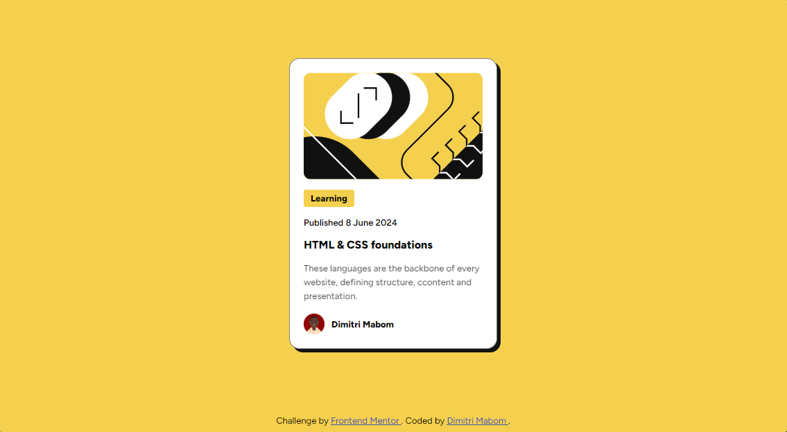

# Frontend Mentor - Blog preview card solution

This is a solution to the [Blog preview card challenge on Frontend Mentor](https://www.frontendmentor.io/challenges/blog-preview-card-ckPaj01IcS). Frontend Mentor challenges help you improve your coding skills by building realistic projects. 

## Table of contents

- [Overview](#overview)
  - [Screenshot](#screenshot)
  - [Links](#links)
- [My process](#my-process)
  - [Built with](#built-with)
  - [What I learned](#what-i-learned)
  - [Useful resources](#useful-resources)
- [Author](#author)

## Overview

### Screenshot



### Links

- Solution URL: [https://github.com/dimysenpai/blog-preview-card](https://github.com/dimysenpai/blog-preview-card)
- Live Site URL: [https://blog-preview-card-j5dt.onrender.com](https://blog-preview-card-j5dt.onrender.com)

## My process

### Built with

- Semantic HTML5 markup
- CSS custom properties
- Flexbox
- Hover
- Shadow

### What I learned

I remembered how to use the hover depending on the parent and child

```css
.card:hover .card_title {
  color: hsl(47, 83%, 68%);
}
```

### Useful resources

- [Free Host](https://render.com/) - Our fastest path to production
Build, deploy, and scale your apps with unparalleled ease – from your first user to your billionth.
- [Font Used](https://fonts.google.com/specimen/Figtree) - This font is really very beautiful

## Author

- Website - [Dimitri Mabom](https://github.com/dimitrimabom)
- Frontend Mentor - [@dimitrimabom](https://www.frontendmentor.io/profile/dimitrimabom)
- Linkedin - [Dimitri Mabom](https://www.linkedin.com/in/dimitri-mabom/)
